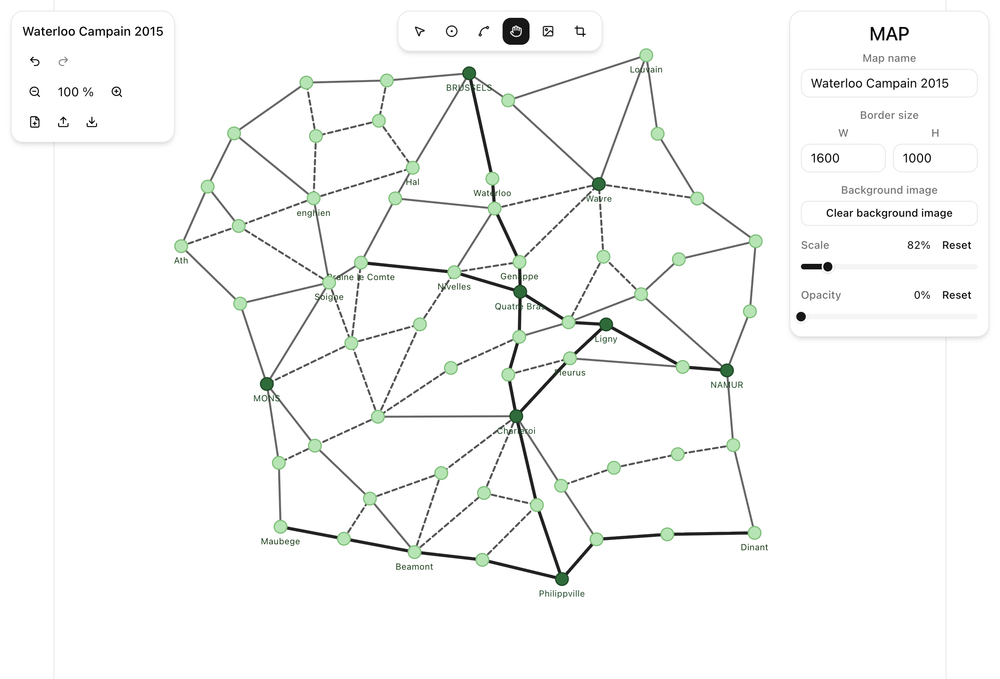

# Map Editor

A browser-based editor for building point-to-point maps for tabletop games, worldbuilding, or route planning. Draw zones on an infinite canvas, connect them with typed edges, and optionally trace over a reference image.



## Tech Stack

- Vite
- React 19
- TypeScript
- Tailwind CSS
- Base UI
- Zustand
- IndexedDB

## Commands

```bash
pnpm install        # Install dependencies
pnpm run dev        # Dev server at http://localhost:5173
pnpm run test       # Run Vitest in watch mode
pnpm run test:run   # Run Vitest
pnpm run build      # Type-check and build for production
pnpm run preview    # Preview the production build
pnpm run lint       # Run ESLint
pnpm run format     # Run Prettier
```
